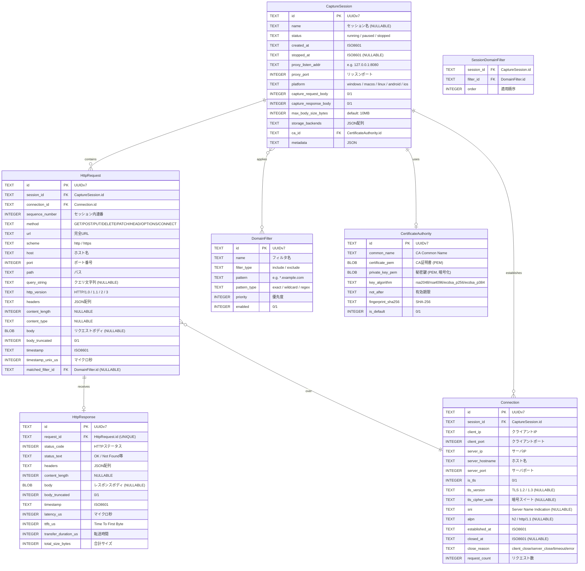
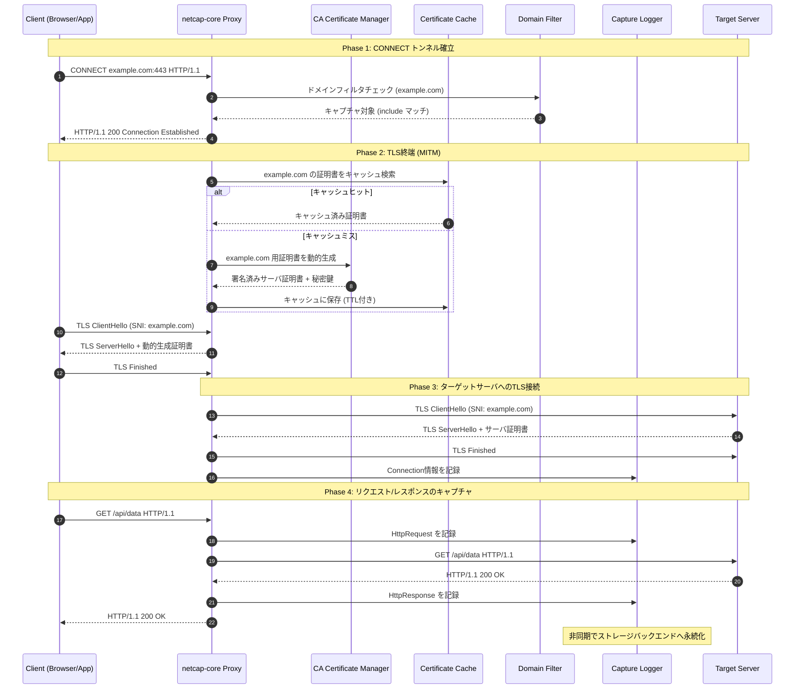
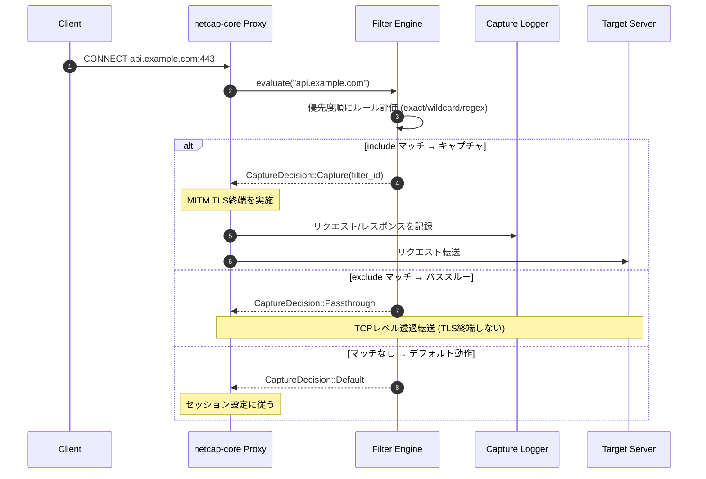
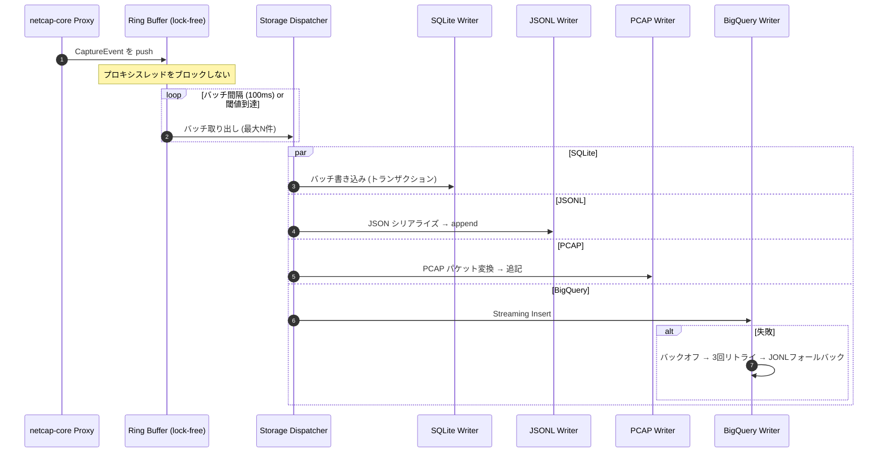
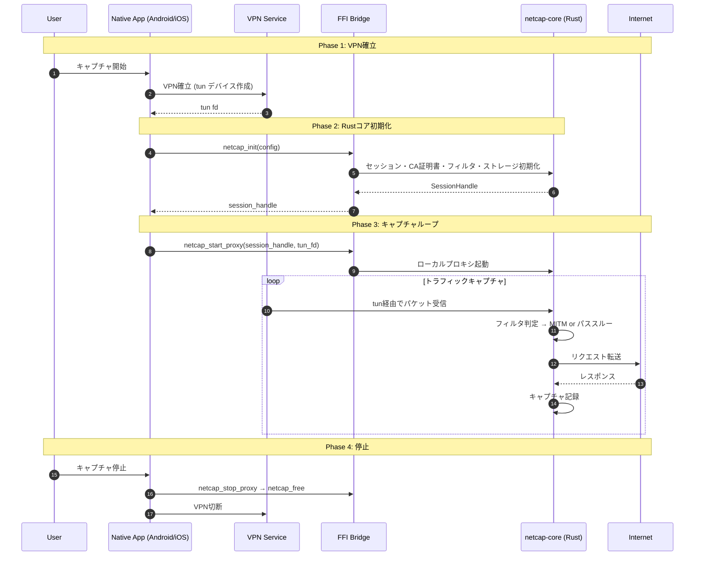
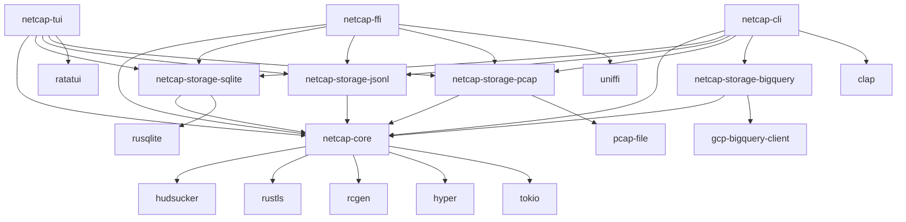

# netcap - Statement of Work (SoW)

> プロジェクト名: netcap
> 作成日: 2026-03-11
> リポジトリ: https://github.com/tk-aria/netcap
> ライセンス: MIT / Apache-2.0

---

## 1. プロジェクト概要

**netcap** は、Rust製のクロスプラットフォームHTTP/HTTPSキャプチャツールである。
MITMプロキシ方式で特定ドメインへのHTTP通信をインターセプトし、リクエスト・レスポンスの全情報（ドメイン、パス、ヘッダー、ボディ）をキャプチャ・保存・分析可能にする。

### 対象プラットフォーム

| プラットフォーム | アプリ形態 | 対応状況 |
|----------------|----------|---------|
| Windows | CLI / TUI | Phase 1 |
| macOS | CLI / TUI | Phase 1 |
| Linux | CLI / TUI | Phase 1 |
| Android | ネイティブアプリ (Kotlin) | Phase 2 |
| iOS | ネイティブアプリ (Swift) | Phase 2 |

### 背景・課題

- Burp Suite等の既存ツールはプロプライエタリで機能制限がある
- mitmproxy (Python) はクロスプラットフォーム対応が限定的
- モバイル対応のOSSキャプチャツールが不足
- キャプチャログをBigQuery等に直接投入して分析するワークフローが確立されていない

### ゴール

1. デスクトップ (Win/Mac/Linux) で動作するCLIキャプチャツール
2. コアライブラリとして切り出し、モバイル (Android/iOS) からFFI経由で利用可能
3. 複数ストレージバックエンド (SQLite / JSONL / PCAP / BigQuery) への並行書き出し
4. ドメインフィルタによる選択的キャプチャ

---

## 2. 機能一覧

### 2.1 コア機能 (netcap-core)

| # | 機能 | 説明 | Phase |
|---|------|------|-------|
| F-01 | MITMプロキシ | HTTP/HTTPSリクエストのインターセプト・転送 | 1 |
| F-02 | TLS終端 | クライアント側TLS終端、サーバー側TLS再接続 | 1 |
| F-03 | 動的証明書生成 | ドメインごとのサーバー証明書をオンデマンド生成 (rcgen) | 1 |
| F-04 | 証明書キャッシュ | 生成済み証明書のTTL付きキャッシュ | 1 |
| F-05 | CA証明書管理 | CA証明書の生成・インポート・エクスポート | 1 |
| F-06 | ドメインフィルタ | include/exclude、exact/wildcard/regex対応 | 1 |
| F-07 | フィルタ優先度制御 | 複数ルールの優先度ベース評価 | 1 |
| F-08 | パススルーモード | フィルタ除外ドメインはTLS終端せず透過転送 | 1 |
| F-09 | HTTP/2サポート | HTTP/2プロトコルのキャプチャ | 1 |
| F-10 | WebSocketサポート | WebSocketメッセージのキャプチャ | 2 |
| F-11 | リクエスト/レスポンスペアリング | リクエストとレスポンスの自動対応付け | 1 |
| F-12 | ボディサイズ制限 | 設定可能な最大ボディサイズでの切り詰め | 1 |
| F-13 | ボディ圧縮解凍 | gzip/br/deflateの自動デコード | 1 |
| F-14 | レイテンシ計測 | TTFB、総レイテンシ、転送時間の計測 | 1 |
| F-15 | Graceful Shutdown | バッファフラッシュ後の安全な停止 | 1 |

### 2.2 ストレージ機能

| # | 機能 | 説明 | Phase |
|---|------|------|-------|
| F-20 | SQLite保存 | ローカルSQLiteデータベースへの保存 (WALモード) | 1 |
| F-21 | JSONL出力 | JSON Lines形式でのファイル出力 | 1 |
| F-22 | PCAP出力 | PCAP/PcapNg形式でのファイル出力 | 1 |
| F-23 | BigQuery連携 | Google BigQueryへのStreaming Insert | 2 |
| F-24 | FanoutWriter | 複数ストレージへの並行書き出し | 1 |
| F-25 | バッファリング | lock-free ring bufferによる非ブロッキングバッファ | 1 |
| F-26 | バッチ書き込み | 設定可能なバッチサイズ・間隔での一括書き込み | 1 |
| F-27 | ファイルローテーション | JSONL出力のサイズベースローテーション | 1 |
| F-28 | BigQueryフォールバック | BQ書き込み失敗時のローカルJSONLフォールバック | 2 |

### 2.3 CLI / TUI 機能

| # | 機能 | 説明 | Phase |
|---|------|------|-------|
| F-30 | captureサブコマンド | プロキシ起動・キャプチャ実行 | 1 |
| F-31 | certサブコマンド | CA証明書の生成・エクスポート | 1 |
| F-32 | replayサブコマンド | キャプチャ済みリクエストの再送 | 2 |
| F-33 | 標準出力ログ | キャプチャ内容のリアルタイム標準出力 | 1 |
| F-34 | TOML設定ファイル | 設定ファイルによるパラメータ管理 | 1 |
| F-35 | TUI表示 | ratatuiによるリアルタイムダッシュボード | 2 |

### 2.4 モバイル連携機能

| # | 機能 | 説明 | Phase |
|---|------|------|-------|
| F-40 | UniFFIバインディング | Kotlin/Swift向け自動バインディング生成 | 2 |
| F-41 | Android VPN統合 | VpnService経由でのトラフィックキャプチャ | 2 |
| F-42 | iOS VPN統合 | NEPacketTunnelProvider経由でのトラフィックキャプチャ | 2 |
| F-43 | FFI経由セッション制御 | init/start/stop/get_events/get_stats | 2 |
| F-44 | フィルタ動的更新 | 実行中のフィルタルール変更 | 2 |
| F-45 | セッションエクスポート | キャプチャデータの形式変換エクスポート | 2 |

---

## 3. E-R図

### 3.1 エンティティ関連図



### 3.2 インデックス戦略

| テーブル | カラム | 種別 | 目的 |
|---------|--------|------|------|
| HttpRequest | session_id, timestamp_unix_us | 複合INDEX | 時系列クエリ |
| HttpRequest | host | INDEX | ホスト名検索 |
| HttpRequest | connection_id | INDEX | 接続別リクエスト |
| HttpResponse | request_id | UNIQUE INDEX | 1:1対応 |
| HttpResponse | status_code | INDEX | ステータス別検索 |
| Connection | session_id | INDEX | セッション内接続 |
| Connection | server_hostname | INDEX | ホスト名検索 |
| SessionDomainFilter | session_id, filter_id | 複合UNIQUE | 重複防止 |

### 3.3 スキーマ設計方針

- ID: UUIDv7 (TEXT型、時系列ソート可能)
- タイムスタンプ: ISO8601 TEXT + Unixマイクロ秒 INTEGER 併用
- ボディ: BLOB型、`max_body_size_bytes` で切り詰め
- ヘッダー: JSON配列としてTEXT型に保存
- SQLite WALモードで並行読み書き対応

---

## 4. シーケンス図

### 4.1 HTTPSキャプチャ全体フロー



### 4.2 フィルタリング処理



### 4.3 ログ永続化フロー



### 4.4 モバイルアプリ連携 (Android / iOS)



### 4.5 FFI関数一覧 (C-ABI)

| 関数名 | 説明 |
|--------|------|
| `netcap_init(config)` | セッション初期化 → SessionHandle |
| `netcap_start_proxy(handle, tun_fd)` | プロキシ起動 |
| `netcap_stop_proxy(handle)` | プロキシ停止 |
| `netcap_get_capture_events(handle, offset, limit)` | キャプチャイベント取得 (JSON) |
| `netcap_get_stats(handle)` | 統計情報取得 |
| `netcap_update_filters(handle, filters)` | フィルタ動的更新 |
| `netcap_export_session(handle, format, path)` | セッションエクスポート |
| `netcap_free(handle)` | メモリ解放 |

---

## 5. ライブラリ・モジュール構成

### 5.1 Cargoワークスペース (8クレート)

| クレート名 | 種別 | 概要 |
|---|---|---|
| `netcap-core` | lib | コアライブラリ（プラットフォーム非依存） |
| `netcap-storage-sqlite` | lib | SQLite ストレージ実装 |
| `netcap-storage-jsonl` | lib | JSONL ファイル出力実装 |
| `netcap-storage-pcap` | lib | PCAP 出力実装 |
| `netcap-storage-bigquery` | lib | BigQuery 連携実装 |
| `netcap-ffi` | lib (cdylib) | C FFI / UniFFI バインディング |
| `netcap-cli` | bin | CLI アプリケーション |
| `netcap-tui` | bin | TUI アプリケーション（オプション） |

### 5.2 クレート間依存関係



### 5.3 netcap-core 内部モジュール

| モジュール | 責務 |
|---|---|
| `proxy` | MITMプロキシエンジン。hudsuckerラップ、リクエスト/レスポンスインターセプト |
| `tls` | TLS終端、CA証明書生成・管理、動的サーバー証明書発行 |
| `capture` | キャプチャロジック、リクエスト/レスポンスペアリング、メタデータ抽出 |
| `filter` | ドメインフィルタリング (exact/wildcard/regex) |
| `storage` | StorageBackend trait定義のみ（実装は別クレート） |

### 5.4 主要Trait

| Trait | 責務 |
|-------|------|
| `CaptureHandler` | キャプチャイベントハンドラ (on_request / on_response / on_error) |
| `StorageBackend` | ストレージ抽象化 (initialize / flush / close)。CaptureHandlerを継承 |
| `DomainMatcher` | ドメインフィルタ (matches / add_pattern / clear) |
| `CertificateProvider` | 証明書プロバイダ (get_ca / issue_server_cert / install / export) |

### 5.5 選定ライブラリ一覧

| カテゴリ | ライブラリ | バージョン | 選定理由 |
|----------|-----------|-----------|---------|
| MITMプロキシ | hudsucker | 0.9.1 | Rust製MITM最適解、hyper/tokio/rustls統合 |
| HTTP | hyper | 1.x | デファクトスタンダード |
| 非同期ランタイム | tokio | 1.50.0 | デファクトスタンダード、LTS |
| TLS | rustls | 0.23.36 | Pure Rust、クロスコンパイル容易 |
| 証明書生成 | rcgen | 0.14.6 | hudsucker統合済、Pure Rust |
| PCAP出力 | pcap-file | 2.x | Pure Rust、PcapNg対応 |
| FFI (Android/iOS) | uniffi | 0.30.0 | Mozilla製、両OS一元管理 |
| FFI (Android補助) | jni | 0.22.0 | VPNService等低レベルAPI用 |
| FFI (iOS補助) | cbindgen + swift-bridge | 0.29.2 / 0.1.59 | フォールバック用 |
| シリアライゼーション | serde + serde_json | 1.0 | デファクトスタンダード |
| ローカルDB | rusqlite | 0.38.0 | SQLiteフル機能、bundled |
| BigQuery | gcp-bigquery-client | 0.27.0 | Streaming Insert対応 |
| CLI | clap | 4.5.x | デファクトスタンダード |
| TUI | ratatui | 0.30.0 | 後続フェーズ |
| クロスコンパイル | cross | 0.2.5 | ゼロセットアップ |
| Androidビルド | cargo-ndk | 4.1.2 | NDK統合標準 |
| iOSビルド | Xcodeスクリプト | - | cargo-lipo非推奨のため |

---

## 6. ディレクトリ構成図

```
netcap/
├── Cargo.toml                          # ワークスペースルート
├── Cargo.lock
├── rust-toolchain.toml                 # Rustツールチェイン + モバイルターゲット
├── .gitignore
├── LICENSE
├── README.md
│
├── crates/                             # Rustクレート群
│   ├── netcap-core/                    # コアライブラリ
│   │   ├── Cargo.toml
│   │   └── src/
│   │       ├── lib.rs                  # クレートルート
│   │       ├── proxy/                  # MITMプロキシエンジン
│   │       │   ├── mod.rs              # ProxyServer, ProxyServerBuilder
│   │       │   ├── handler.rs          # hudsucker HttpHandler実装
│   │       │   └── connection.rs       # コネクション管理
│   │       ├── tls/                    # TLS・証明書管理
│   │       │   ├── mod.rs              # CertificateProvider trait
│   │       │   ├── ca.rs               # CA証明書生成・管理
│   │       │   ├── server_cert.rs      # 動的サーバー証明書発行
│   │       │   └── store.rs            # 証明書キャッシュ
│   │       ├── capture/                # キャプチャロジック
│   │       │   ├── mod.rs              # CaptureHandler trait
│   │       │   ├── exchange.rs         # CapturedRequest/Response/Exchange
│   │       │   └── body.rs             # ボディ処理（圧縮解凍、サイズ制限）
│   │       ├── filter/                 # ドメインフィルタ
│   │       │   ├── mod.rs              # DomainMatcher trait, DomainFilter
│   │       │   └── pattern.rs          # ワイルドカード・正規表現マッチ
│   │       ├── storage/                # ストレージ抽象
│   │       │   └── mod.rs              # StorageBackend trait, FanoutWriter
│   │       ├── config.rs               # ProxyConfig等
│   │       └── error.rs                # エラー型階層
│   │
│   ├── netcap-storage-sqlite/          # SQLiteストレージ
│   │   └── src/ (lib.rs, schema.rs, queries.rs)
│   ├── netcap-storage-jsonl/           # JSONL出力
│   │   └── src/ (lib.rs, serializer.rs, rotation.rs)
│   ├── netcap-storage-pcap/            # PCAP出力
│   │   └── src/ (lib.rs, converter.rs)
│   ├── netcap-storage-bigquery/        # BigQuery連携
│   │   └── src/ (lib.rs, schema.rs, batch.rs)
│   ├── netcap-ffi/                     # FFIバインディング
│   │   └── src/ (lib.rs, proxy.rs, types.rs, error.rs, netcap.udl)
│   ├── netcap-cli/                     # CLIアプリ
│   │   └── src/ (main.rs, args.rs, commands/, output.rs)
│   └── netcap-tui/                     # TUIアプリ (オプション)
│       └── src/ (main.rs, app.rs, ui/, event.rs)
│
├── tests/integration/                  # 統合テスト
├── examples/                           # 使用例
├── android/                            # Kotlin + VpnService + UniFFI
├── ios/                                # Swift + NEPacketTunnelProvider + UniFFI
├── docs/                               # 設計ドキュメント
├── .github/workflows/                  # CI/CD (ci/release/android/ios)
├── scripts/                            # ビルドスクリプト
└── config/                             # 設定テンプレート
```

---

## 7. 開発フェーズ

### Phase 1: デスクトップCLI (MVP)

**スコープ:** Windows / macOS / Linux 向けCLIツール

| 項目 | 内容 |
|------|------|
| 対象機能 | F-01〜F-15, F-20〜F-22, F-24〜F-27, F-30〜F-31, F-33〜F-34 |
| 成果物 | `netcap` CLIバイナリ (x86_64/aarch64) |
| 主要タスク | netcap-core実装、SQLite/JSONL/PCAPストレージ、CLIインターフェース |
| テスト | ユニットテスト + E2E (proxy/tls/filter/storage) |
| CI/CD | GitHub Actions (ci.yml, release.yml) |

### Phase 2: モバイル + 追加機能

**スコープ:** Android / iOS 対応、BigQuery連携、TUI

| 項目 | 内容 |
|------|------|
| 対象機能 | F-10, F-23, F-28, F-32, F-35, F-40〜F-45 |
| 成果物 | Android APK, iOS IPA, TUIバイナリ |
| 主要タスク | UniFFIバインディング、VPN統合、BigQuery連携、ratatui TUI |
| CI/CD | GitHub Actions (android.yml, ios.yml) |

---

## 8. リスクと対策

| リスク | 影響度 | 対策 |
|--------|-------|------|
| hudsuckerの開発停滞 | 高 | フォークして自社メンテナンス、or http-mitm-proxy切替 |
| UniFFI破壊的変更 | 中 | バージョン固定、cbindgen+jniフォールバック |
| gcp-bigquery-client非互換 | 低 | reqwest直接呼び出しフォールバック |
| rustls互換性問題 | 低 | native-tls featureで切替可能 |
| cargo-lipo完全廃止 | なし | Xcodeスクリプト方式を採用済み |
| TLS証明書ピンニング | 中 | パススルーフォールバック、ログで記録 |
| モバイルVPN権限制約 | 中 | OSバージョン別の対応ドキュメント整備 |

---

## 9. エラーハンドリング方針

| 障害箇所 | 挙動 | リカバリ |
|----------|------|----------|
| CA証明書生成失敗 | セッション開始を拒否 | CA再生成を促す |
| ターゲットサーバ接続失敗 | 502 Bad Gateway返却 | close_reason="error" |
| SQLite書き出し失敗 | エラーログ、リトライ | 3回失敗で一時無効化 |
| BigQuery書き出し失敗 | JONLフォールバック | 接続回復後に再送 |
| バッファオーバーフロー | 古いイベント破棄 | drop countメトリクス記録 |
| TLSハンドシェイク失敗 | パススルーフォールバック | cert pinning可能性ログ |
| VPN切断 (モバイル) | セッション自動停止 | バッファフラッシュ後停止 |

---

## 10. キャプチャログ取得方式

netcap は利用形態に応じて **Push型（イベント駆動）** と **Pull型（API polling）** の2つのログ取得方式を提供する。

### 10.1 方式一覧

| 利用形態 | 方式 | ログ出力 | polling要否 |
|----------|------|----------|-------------|
| CLI (デスクトップ) | Push（自動） | stdoutリアルタイム出力 + ファイル/DB書き出し | 不要 |
| ライブラリ組み込み | Push（callback） | `CaptureHandler` trait の `on_request` / `on_response` で受信 | 不要 |
| Mobile FFI | Pull（polling） | `netcap_get_capture_events(handle, offset, limit)` で取得 | 必要 |

### 10.2 Push型：イベント駆動（CLI / ライブラリ）

HTTP通信が発生する度に自動でキャプチャされ、ログが出力される。明示的な polling は不要。

```
HTTP通信発生
  → Proxy が intercept
  → CaptureHandler.on_request() / on_response() コールバック自動発火
  → Ring Buffer に push (lock-free, non-blocking)
  → Storage Dispatcher がバッチ取り出し (100ms間隔 or 閾値到達)
  → SQLite / JSONL / PCAP に並行書き出し
  → 同時に stdout へリアルタイム出力 (F-33: 標準出力ログ)
```

**データフロー図:**

```
┌────────┐    ┌───────────┐    ┌────────────┐    ┌────────────┐
│ Client │───>│  Proxy    │───>│ Capture    │───>│ Ring Buffer│
│        │    │ (MITM)    │    │ Handler    │    │ (lock-free)│
└────────┘    └───────────┘    └────────────┘    └─────┬──────┘
                                                       │
                                              100ms or threshold
                                                       │
                                                       v
                                              ┌────────────────┐
                                              │   Dispatcher   │
                                              └───┬───┬───┬────┘
                                                  │   │   │
                                          ┌───────┘   │   └───────┐
                                          v           v           v
                                      ┌───────┐ ┌────────┐ ┌──────┐
                                      │SQLite │ │ JSONL  │ │ PCAP │
                                      │(WAL)  │ │(append)│ │      │
                                      └───────┘ └────────┘ └──────┘
                                          同時に stdout へリアルタイム出力
```

**ライブラリとして組み込む場合:**

`CaptureHandler` trait を実装することで、任意のカスタム処理をコールバックとして登録できる。

```rust
#[async_trait]
pub trait CaptureHandler: Send + Sync + 'static {
    /// リクエスト受信時に自動で呼ばれる
    async fn on_request(&self, request: &CapturedRequest) -> bool;
    /// レスポンス受信時に自動で呼ばれる
    async fn on_response(&self, exchange: &CapturedExchange);
    /// エラー発生時に自動で呼ばれる
    async fn on_error(&self, request_id: Uuid, error: &CaptureError);
}
```

### 10.3 Pull型：API polling（Mobile FFI）

モバイルアプリでは、Rust Core 内部は Push型でキャプチャ・記録を行うが、ネイティブアプリ (Kotlin/Swift) からの取得は FFI 経由の polling で行う。

```
Rust Core 内部: Push型で自動記録 (Ring Buffer → Storage)
                    ↓
ネイティブアプリ: FFI 関数を呼び出してイベントを取得
  netcap_get_capture_events(handle, offset, limit)
  → JSON形式でキャプチャイベント一覧を返却
```

**FFI関数（Pull用）:**

| 関数名 | 説明 |
|--------|------|
| `netcap_get_capture_events(handle, offset, limit)` | キャプチャイベントをページネーション付きで取得 (JSON) |
| `netcap_get_stats(handle)` | 総リクエスト数・レスポンス数・接続数等の統計情報を取得 |

**Pull型を採用する理由（モバイル）:**

- モバイルのUIスレッドにRustからの直接コールバックを行うと、スレッド安全性やABI互換性の問題が生じる
- ネイティブUI (Jetpack Compose / SwiftUI) はリアクティブモデルであり、定期的なstate更新の方が自然
- offset/limit によるページネーションで、UIのスクロール位置に応じた効率的なデータ取得が可能

### 10.4 将来の拡張: Server-Sent Events / WebSocket

将来的に、netcap を Web UI と連携させる場合は、Push型のイベント配信を HTTP ベースで提供することも検討可能。

| 方式 | 用途 |
|------|------|
| SSE (Server-Sent Events) | Web UI へのリアルタイムイベントストリーム配信 |
| WebSocket | 双方向通信（フィルタ変更 + イベント受信） |

これらは Phase 2 以降の拡張として位置づける。

---

## 付録A: 詳細設計ドキュメント参照

| # | ドキュメント | ファイル |
|---|-------------|---------|
| 1 | ライブラリ選定 | [01_library_selection.md](./01_library_selection.md) |
| 2 | E-R図 | [02_er_diagram.md](./02_er_diagram.md) |
| 3 | シーケンス図 | [03_sequence_diagram.md](./03_sequence_diagram.md) |
| 4 | モジュール構成 | [04_module_architecture.md](./04_module_architecture.md) |
| 5 | ディレクトリ構成 | [05_directory_structure.md](./05_directory_structure.md) |
