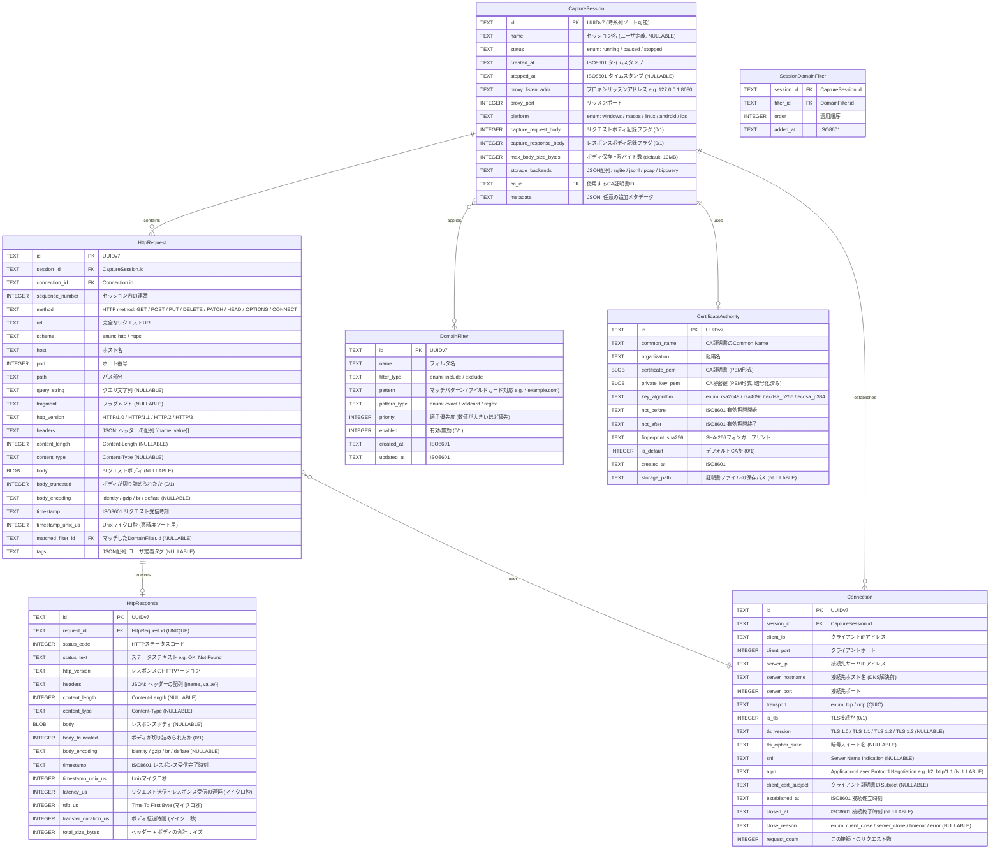

# E-R図: netcap-core データモデル

## 概要

netcap-core が扱うデータモデルのEntity-Relationship図。
キャプチャセッション、HTTP通信、接続情報、フィルタ設定、CA証明書を中心に構成される。

## E-R図

## エンティティ詳細

### CaptureSession
キャプチャの論理的な単位。ユーザがキャプチャを開始してから停止するまでの期間を表す。
- プラットフォーム情報、プロキシ設定、ストレージバックエンド設定を保持
- 1つのCAと紐づく (MITM用)

### HttpRequest
プロキシが受信したHTTPリクエストの全情報。
- URL はパース済みの各パート (scheme, host, port, path, query_string) も個別カラムに保持し、高速なフィルタ・検索を可能にする
- `sequence_number` でセッション内の時系列順序を保証
- `body` は設定に応じて保存/非保存を切り替え可能

### HttpResponse
リクエストに対応するレスポンス。1:1対応。
- レスポンスが得られなかった場合 (接続断等) は HttpResponse レコードが存在しない (0..1)
- `latency_us`, `ttfb_us`, `transfer_duration_us` でパフォーマンス分析が可能

### Connection
TCP/UDP接続レベルの情報。1つの接続上で複数のHTTPリクエストが流れうる (HTTP/1.1 Keep-Alive, HTTP/2 Multiplexing)。
- TLS関連情報 (バージョン、暗号スイート、SNI、ALPN) を保持
- `request_count` で接続の多重化度を把握可能

### DomainFilter
キャプチャ対象/除外を制御するドメインフィルタ。
- `include` / `exclude` タイプで包含・除外を指定
- ワイルドカード (`*.example.com`) または正規表現でパターンマッチ
- `priority` による優先度制御

### CertificateAuthority
MITM用のCA証明書情報。
- RSA / ECDSA の鍵アルゴリズム対応
- 秘密鍵は暗号化された状態で保存

### SessionDomainFilter (中間テーブル)
CaptureSession と DomainFilter の多対多リレーションを実現する中間テーブル。
- `order` で同一セッション内のフィルタ適用順序を制御

## インデックス戦略

| テーブル | カラム | 種別 | 目的 |
|---------|--------|------|------|
| HttpRequest | session_id, timestamp_unix_us | 複合INDEX | セッション内の時系列クエリ |
| HttpRequest | host | INDEX | ホスト名での検索 |
| HttpRequest | method, status (JOIN) | INDEX | メソッド別集計 |
| HttpRequest | connection_id | INDEX | 接続ごとのリクエスト一覧 |
| HttpResponse | request_id | UNIQUE INDEX | リクエストとの1:1対応 |
| HttpResponse | status_code | INDEX | ステータスコード別検索 |
| Connection | session_id | INDEX | セッション内の接続一覧 |
| Connection | server_hostname | INDEX | ホスト名での接続検索 |
| DomainFilter | pattern | INDEX | パターンマッチ検索 |
| SessionDomainFilter | session_id, filter_id | 複合UNIQUE INDEX | 重複防止 |

## SQLiteスキーマ補足

- すべてのIDは UUIDv7 を TEXT 型で保存 (時系列ソート可能)
- タイムスタンプは ISO8601 の TEXT 型 + Unixマイクロ秒の INTEGER 型を併用
- ボディは BLOB 型で保存し、大きなボディは `max_body_size_bytes` で切り詰め
- ヘッダーは JSON 配列として TEXT 型に保存 (`[{"name": "Content-Type", "value": "application/json"}]`)
- WAL モードで並行読み書きに対応
