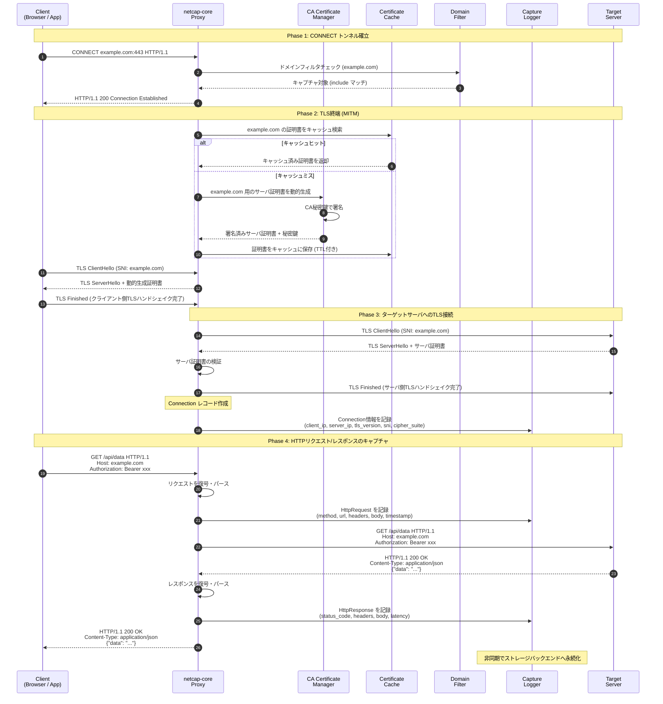
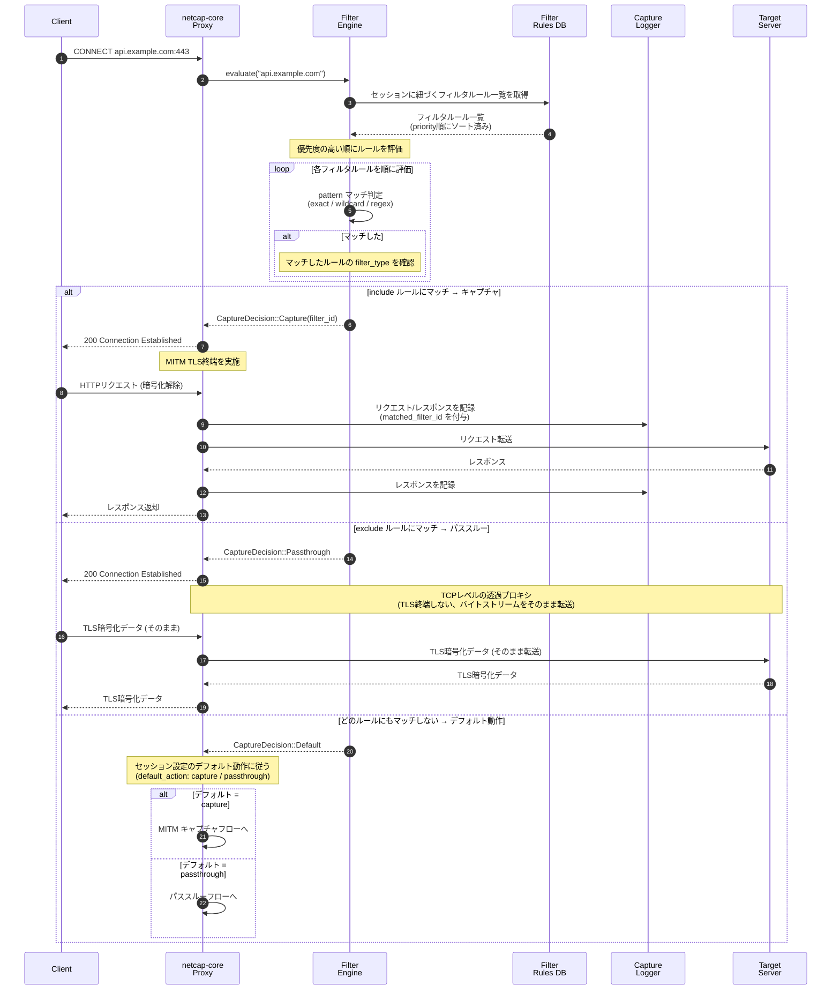
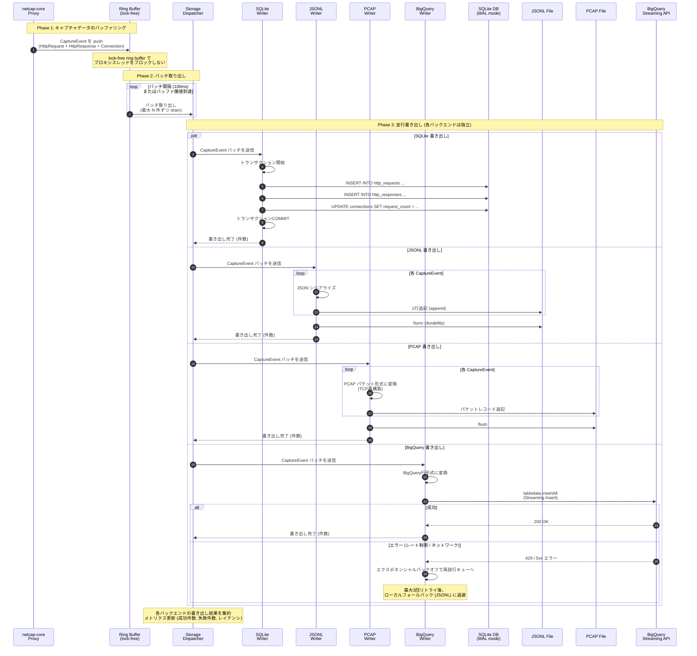
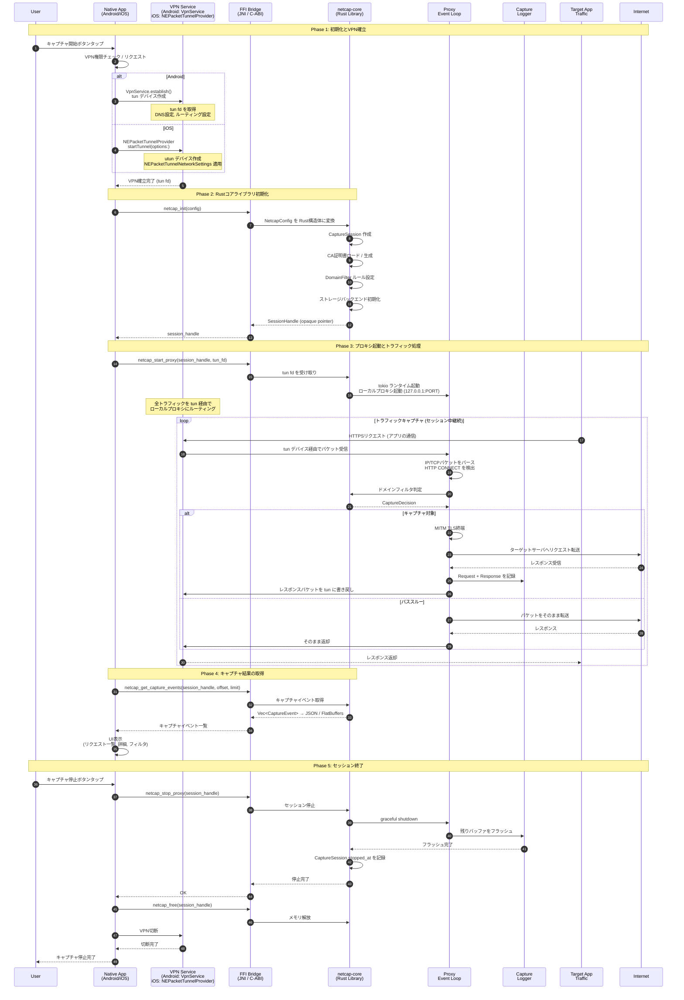

# シーケンス図: netcap-core 処理フロー

## 概要

netcap-core の主要な処理フローをシーケンス図で記載する。

---

## シーケンス1: HTTPSキャプチャの全体フロー

クライアントからのHTTPSリクエストをMITMプロキシがインターセプトし、
TLS終端・再暗号化を行いながらキャプチャする一連のフロー。

---

## シーケンス2: フィルタリング処理

リクエスト受信時のドメインフィルタリング判定フロー。
include/exclude ルールの優先度に基づいて、キャプチャ対象かパススルーかを判定する。

---

## シーケンス3: ログ永続化フロー

キャプチャしたHTTP通信データを複数のストレージバックエンドへ並行書き出しするフロー。
バッファリングとバッチ処理でI/O負荷を抑える。

---

## シーケンス4: モバイルアプリ連携 (Android / iOS)

ネイティブモバイルアプリから VPN/ローカルプロキシ経由で Rust コアライブラリ (FFI) を呼び出し、
HTTP通信をキャプチャする連携フロー。

---

## 補足: FFI関数一覧 (C-ABI)

モバイルアプリ連携で使用する主要なFFI関数。

| 関数名 | 引数 | 戻り値 | 説明 |
|--------|------|--------|------|
| `netcap_init` | `config: *const c_char` (JSON) | `*mut SessionHandle` | セッション初期化 |
| `netcap_start_proxy` | `handle: *mut SessionHandle, tun_fd: c_int` | `c_int` (0=成功) | プロキシ起動 |
| `netcap_stop_proxy` | `handle: *mut SessionHandle` | `c_int` | プロキシ停止 |
| `netcap_get_capture_events` | `handle: *mut SessionHandle, offset: u64, limit: u64` | `*mut c_char` (JSON) | キャプチャイベント取得 |
| `netcap_get_stats` | `handle: *mut SessionHandle` | `*mut c_char` (JSON) | 統計情報取得 |
| `netcap_update_filters` | `handle: *mut SessionHandle, filters: *const c_char` | `c_int` | フィルタ動的更新 |
| `netcap_export_session` | `handle: *mut SessionHandle, format: *const c_char, path: *const c_char` | `c_int` | セッションエクスポート |
| `netcap_free` | `handle: *mut SessionHandle` | `void` | メモリ解放 |

---

## 補足: エラーハンドリング方針

各シーケンスにおける障害時の動作方針。

| 障害箇所 | 挙動 | リカバリ |
|----------|------|----------|
| CA証明書生成失敗 | セッション開始を拒否 | ユーザにCA再生成を促す |
| ターゲットサーバ接続失敗 | 502 Bad Gateway をクライアントに返却 | Connection.close_reason = "error" を記録 |
| ストレージ書き出し失敗 (SQLite) | エラーログ出力、リトライ | 3回失敗で該当バックエンドを一時無効化 |
| ストレージ書き出し失敗 (BigQuery) | ローカル JSONL にフォールバック | 接続回復後にリトライキューから再送 |
| バッファオーバーフロー | 古いイベントを破棄 (ring buffer) | メトリクスで drop count を記録 |
| TLSハンドシェイク失敗 | パススルーにフォールバック | TLS固定 (certificate pinning) の可能性をログ記録 |
| VPN切断 (モバイル) | セッションを自動停止 | バッファ内データをフラッシュしてから停止 |
