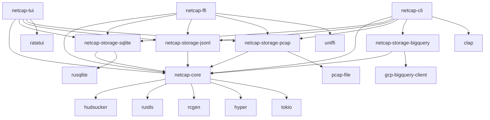
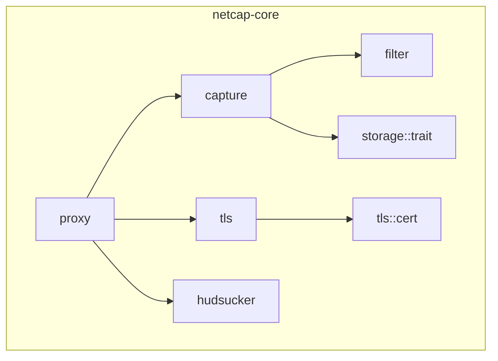

# モジュール・アーキテクチャ設計

## 1. Cargo ワークスペース構成

本プロジェクトはモノレポ構成を採用し、以下のクレートに分割する。

| クレート名 | 種別 | 概要 |
|---|---|---|
| `netcap-core` | lib | コアライブラリ（プラットフォーム非依存） |
| `netcap-storage-sqlite` | lib | SQLite ストレージ実装 |
| `netcap-storage-jsonl` | lib | JSONL ファイル出力実装 |
| `netcap-storage-pcap` | lib | PCAP 出力実装 |
| `netcap-storage-bigquery` | lib | BigQuery 連携実装 |
| `netcap-ffi` | lib (cdylib) | C FFI / UniFFI バインディング |
| `netcap-cli` | bin | CLI アプリケーション |
| `netcap-tui` | bin | TUI アプリケーション（オプション） |

## 2. クレート間依存関係



## 3. netcap-core 内部モジュール構成



| モジュール | 責務 |
|---|---|
| `proxy` | MITM プロキシエンジン。hudsucker をラップし、HTTP/HTTPS リクエスト・レスポンスをインターセプト |
| `tls` | TLS 終端処理。CA 証明書の生成・管理、動的サーバー証明書発行 |
| `capture` | キャプチャロジック。リクエスト/レスポンスのペアリング、メタデータ抽出 |
| `filter` | ドメインフィルタリング。ワイルドカード・正規表現によるマッチング |
| `storage` | ストレージ抽象化。`StorageBackend` trait 定義のみ（実装は別クレート） |

## 4. 主要 Trait 定義

### 4.1 CaptureHandler — キャプチャイベントハンドラ

```rust
use async_trait::async_trait;

/// キャプチャされたHTTPリクエスト
#[derive(Debug, Clone)]
pub struct CapturedRequest {
    pub id: uuid::Uuid,
    pub timestamp: chrono::DateTime<chrono::Utc>,
    pub method: http::Method,
    pub uri: http::Uri,
    pub version: http::Version,
    pub headers: http::HeaderMap,
    pub body: bytes::Bytes,
    /// TLS情報（HTTPS の場合）
    pub tls_info: Option<TlsInfo>,
}

/// キャプチャされたHTTPレスポンス
#[derive(Debug, Clone)]
pub struct CapturedResponse {
    pub request_id: uuid::Uuid,
    pub timestamp: chrono::DateTime<chrono::Utc>,
    pub status: http::StatusCode,
    pub version: http::Version,
    pub headers: http::HeaderMap,
    pub body: bytes::Bytes,
    /// レスポンスまでの所要時間
    pub elapsed: std::time::Duration,
}

/// TLS接続情報
#[derive(Debug, Clone)]
pub struct TlsInfo {
    pub sni: String,
    pub protocol_version: String,
    pub cipher_suite: String,
}

/// キャプチャされたリクエスト/レスポンスのペア
#[derive(Debug, Clone)]
pub struct CapturedExchange {
    pub request: CapturedRequest,
    pub response: Option<CapturedResponse>,
}

/// キャプチャイベントを受信するハンドラ
#[async_trait]
pub trait CaptureHandler: Send + Sync + 'static {
    /// リクエスト受信時に呼ばれる。falseを返すとキャプチャをスキップ
    async fn on_request(&self, request: &CapturedRequest) -> bool {
        let _ = request;
        true
    }

    /// レスポンス受信時に呼ばれる
    async fn on_response(&self, exchange: &CapturedExchange);

    /// エラー発生時に呼ばれる
    async fn on_error(&self, request_id: uuid::Uuid, error: &CaptureError) {
        let _ = (request_id, error);
    }
}
```

### 4.2 StorageBackend — ストレージ抽象化

```rust
use async_trait::async_trait;

/// ストレージの設定（各実装が独自の型で提供）
pub trait StorageConfig: Send + Sync + 'static {}

/// キャプチャデータの永続化を担うストレージバックエンド
#[async_trait]
pub trait StorageBackend: CaptureHandler {
    type Config: StorageConfig;

    /// ストレージを初期化する
    async fn initialize(config: Self::Config) -> Result<Self, StorageError>
    where
        Self: Sized;

    /// ストレージをフラッシュする（バッファリングされたデータを書き出す）
    async fn flush(&self) -> Result<(), StorageError>;

    /// ストレージを閉じる
    async fn close(self) -> Result<(), StorageError>;
}

/// 複数のストレージに同時書き込みするファンアウトライター
pub struct FanoutWriter {
    backends: Vec<Box<dyn StorageBackend<Config = ()>>>,
}
```

### 4.3 DomainMatcher — ドメインフィルタ

```rust
/// ドメインフィルタのマッチモード
#[derive(Debug, Clone)]
pub enum DomainPattern {
    /// 完全一致（例: "example.com"）
    Exact(String),
    /// ワイルドカード（例: "*.example.com"）
    Wildcard(String),
    /// 正規表現（例: "^api\\..*\\.example\\.com$"）
    Regex(regex::Regex),
}

/// フィルタの動作モード
#[derive(Debug, Clone)]
pub enum FilterMode {
    /// 指定ドメインのみキャプチャ（ホワイトリスト）
    AllowList,
    /// 指定ドメインを除外（ブラックリスト）
    DenyList,
}

/// ドメインベースのフィルタリングを行う
pub trait DomainMatcher: Send + Sync + 'static {
    /// ドメインがフィルタ条件にマッチするか判定する
    fn matches(&self, domain: &str) -> bool;

    /// フィルタルールを追加する
    fn add_pattern(&mut self, pattern: DomainPattern);

    /// フィルタルールをクリアする
    fn clear(&mut self);
}

/// デフォルトのドメインフィルタ実装
pub struct DomainFilter {
    mode: FilterMode,
    patterns: Vec<DomainPattern>,
}
```

### 4.4 CertificateProvider — 証明書プロバイダ

```rust
use async_trait::async_trait;

/// CA証明書と秘密鍵のペア
#[derive(Debug, Clone)]
pub struct CaCertificate {
    pub cert_pem: String,
    pub key_pem: String,
}

/// 動的に生成されたサーバー証明書
pub struct ServerCertificate {
    pub cert_der: Vec<u8>,
    pub key_der: Vec<u8>,
}

/// TLS MITMに使用する証明書を提供する
#[async_trait]
pub trait CertificateProvider: Send + Sync + 'static {
    /// CA証明書を取得（または新規生成）する
    async fn get_ca_certificate(&self) -> Result<CaCertificate, CertError>;

    /// 指定ドメイン用のサーバー証明書を動的生成する
    async fn issue_server_certificate(
        &self,
        domain: &str,
    ) -> Result<ServerCertificate, CertError>;

    /// CA証明書をシステムの信頼ストアにインストールする（プラットフォーム依存）
    async fn install_ca_certificate(&self) -> Result<(), CertError>;

    /// CA証明書をエクスポートする（モバイル端末への転送用）
    async fn export_ca_certificate(&self, path: &std::path::Path) -> Result<(), CertError>;
}
```

## 5. 主要 Struct と責務

### 5.1 ProxyServer — プロキシサーバー本体

```rust
use tokio::sync::broadcast;

/// プロキシサーバーの設定
#[derive(Debug, Clone)]
pub struct ProxyConfig {
    /// リッスンアドレス（例: "0.0.0.0:8080"）
    pub listen_addr: std::net::SocketAddr,
    /// 上流プロキシ（オプション）
    pub upstream_proxy: Option<String>,
    /// 最大同時接続数
    pub max_connections: usize,
    /// リクエストボディの最大サイズ
    pub max_body_size: usize,
    /// タイムアウト
    pub request_timeout: std::time::Duration,
}

/// MITMプロキシサーバー
pub struct ProxyServer {
    config: ProxyConfig,
    cert_provider: Box<dyn CertificateProvider>,
    domain_filter: Box<dyn DomainMatcher>,
    handlers: Vec<Box<dyn CaptureHandler>>,
    shutdown_tx: broadcast::Sender<()>,
}

impl ProxyServer {
    /// プロキシサーバーを構築する
    pub fn builder() -> ProxyServerBuilder { ... }

    /// プロキシサーバーを開始する（ブロッキング）
    pub async fn run(&self) -> Result<(), ProxyError> { ... }

    /// プロキシサーバーを停止する
    pub async fn shutdown(&self) -> Result<(), ProxyError> { ... }
}
```

### 5.2 ProxyServerBuilder — ビルダーパターン

```rust
pub struct ProxyServerBuilder {
    config: ProxyConfig,
    cert_provider: Option<Box<dyn CertificateProvider>>,
    domain_filter: Option<Box<dyn DomainMatcher>>,
    handlers: Vec<Box<dyn CaptureHandler>>,
}

impl ProxyServerBuilder {
    pub fn listen_addr(mut self, addr: std::net::SocketAddr) -> Self { ... }
    pub fn cert_provider(mut self, provider: impl CertificateProvider) -> Self { ... }
    pub fn domain_filter(mut self, filter: impl DomainMatcher) -> Self { ... }
    pub fn add_handler(mut self, handler: impl CaptureHandler) -> Self { ... }
    pub fn build(self) -> Result<ProxyServer, ProxyError> { ... }
}
```

## 6. 各ストレージクレートの実装概要

### 6.1 netcap-storage-sqlite

```rust
pub struct SqliteStorageConfig {
    pub db_path: std::path::PathBuf,
    /// WAL モード有効化
    pub wal_mode: bool,
    /// バッチ書き込みサイズ
    pub batch_size: usize,
}

pub struct SqliteStorage {
    pool: r2d2::Pool<r2d2_sqlite::SqliteConnectionManager>,
    buffer: tokio::sync::Mutex<Vec<CapturedExchange>>,
    config: SqliteStorageConfig,
}
```

### 6.2 netcap-storage-jsonl

```rust
pub struct JsonlStorageConfig {
    pub output_path: std::path::PathBuf,
    /// ファイルローテーションサイズ（バイト）
    pub rotate_size: Option<u64>,
    /// gzip 圧縮
    pub compress: bool,
}

pub struct JsonlStorage {
    writer: tokio::sync::Mutex<tokio::io::BufWriter<tokio::fs::File>>,
    config: JsonlStorageConfig,
}
```

### 6.3 netcap-storage-pcap

```rust
pub struct PcapStorageConfig {
    pub output_path: std::path::PathBuf,
    /// スナップショット長
    pub snaplen: u32,
}

pub struct PcapStorage {
    writer: tokio::sync::Mutex<pcap_file::PcapWriter<std::io::BufWriter<std::fs::File>>>,
    config: PcapStorageConfig,
}
```

### 6.4 netcap-storage-bigquery

```rust
pub struct BigQueryStorageConfig {
    pub project_id: String,
    pub dataset_id: String,
    pub table_id: String,
    /// サービスアカウントキーのパス
    pub credentials_path: std::path::PathBuf,
    /// バッチ挿入サイズ
    pub batch_size: usize,
    /// フラッシュ間隔
    pub flush_interval: std::time::Duration,
}

pub struct BigQueryStorage {
    client: gcp_bigquery_client::Client,
    buffer: tokio::sync::Mutex<Vec<CapturedExchange>>,
    config: BigQueryStorageConfig,
}
```

## 7. netcap-ffi — FFI バインディング設計

```rust
// UniFFI を使用してKotlin/Swift向けバインディングを自動生成

/// FFI公開用のプロキシ制御インターフェース
pub struct NetcapProxy {
    inner: std::sync::Arc<tokio::sync::Mutex<Option<ProxyServer>>>,
    runtime: tokio::runtime::Runtime,
}

impl NetcapProxy {
    /// プロキシを生成する
    pub fn new(config: FfiProxyConfig) -> Result<Self, FfiError> { ... }

    /// プロキシを開始する（バックグラウンドスレッド）
    pub fn start(&self) -> Result<(), FfiError> { ... }

    /// プロキシを停止する
    pub fn stop(&self) -> Result<(), FfiError> { ... }

    /// CA証明書をPEM形式で取得する
    pub fn get_ca_certificate_pem(&self) -> Result<String, FfiError> { ... }

    /// 現在のキャプチャ統計を取得する
    pub fn get_stats(&self) -> Result<FfiCaptureStats, FfiError> { ... }
}

/// FFI向け簡易設定
pub struct FfiProxyConfig {
    pub listen_port: u16,
    pub storage_path: String,
    pub domain_filters: Vec<String>,
}

/// FFI向けキャプチャ統計
pub struct FfiCaptureStats {
    pub total_requests: u64,
    pub total_responses: u64,
    pub active_connections: u32,
    pub bytes_captured: u64,
}
```

## 8. エラー型設計

```rust
/// コアライブラリのエラー型
#[derive(Debug, thiserror::Error)]
pub enum CaptureError {
    #[error("proxy error: {0}")]
    Proxy(#[from] ProxyError),

    #[error("TLS error: {0}")]
    Tls(#[from] CertError),

    #[error("storage error: {0}")]
    Storage(#[from] StorageError),

    #[error("filter error: {0}")]
    Filter(String),

    #[error("IO error: {0}")]
    Io(#[from] std::io::Error),
}

#[derive(Debug, thiserror::Error)]
pub enum ProxyError {
    #[error("bind failed on {addr}: {source}")]
    BindFailed {
        addr: std::net::SocketAddr,
        source: std::io::Error,
    },

    #[error("upstream connection failed: {0}")]
    UpstreamConnection(String),

    #[error("proxy already running")]
    AlreadyRunning,

    #[error("proxy not running")]
    NotRunning,
}

#[derive(Debug, thiserror::Error)]
pub enum StorageError {
    #[error("initialization failed: {0}")]
    InitFailed(String),

    #[error("write failed: {0}")]
    WriteFailed(String),

    #[error("flush failed: {0}")]
    FlushFailed(String),

    #[error("connection lost: {0}")]
    ConnectionLost(String),
}

#[derive(Debug, thiserror::Error)]
pub enum CertError {
    #[error("CA certificate generation failed: {0}")]
    CaGenerationFailed(String),

    #[error("server certificate generation failed for {domain}: {source}")]
    ServerCertFailed {
        domain: String,
        source: Box<dyn std::error::Error + Send + Sync>,
    },

    #[error("certificate store access failed: {0}")]
    StoreAccessFailed(String),
}
```
